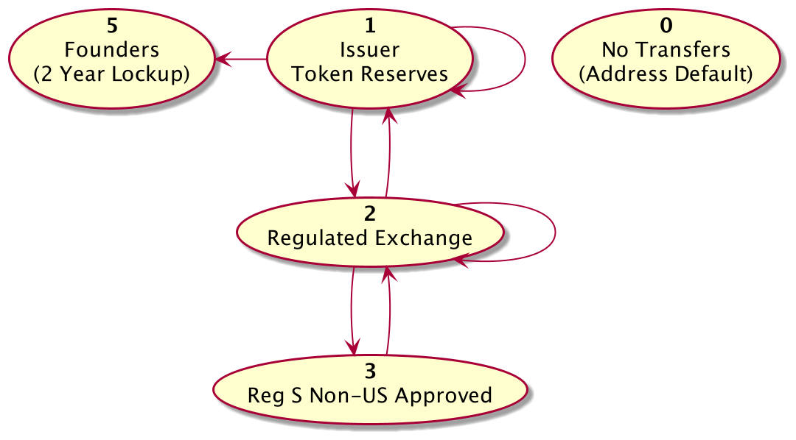
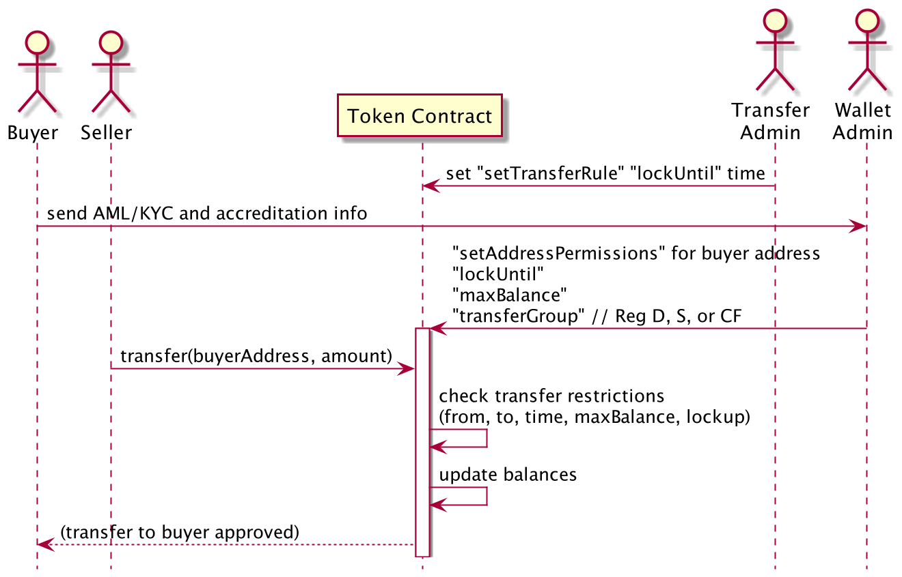

# Algorand Security Token

This is an Open Source Algorand security token compatible with CoMakery. Although it is built on Algorand it is influenced by the Ethereum ERC-1404 security token standard. 

The contract is written as a Python [PyTeal](https://github.com/algorand/pyteal) script that generates an Algorand TEAL Smart Contract.

This token is modeled on the [CoMakery Security Token specification](https://github.com/CoMakery/comakery-security-token). An Algorand TEAL version was adapted from the CoMakery Security Token spec by [Derek Leung](https://github.com/derbear) at [Algorand Foundation](https://algorand.foundation/) in Racket with sTEAL. This codebase is the PyTeal rewrite of Derek's work by Jason Paulos with additional modifications by Noah Thorp and the CoMakery Team.

__Although we hope this code is useful to you, it comes with no warranty of any kind. Do your own security audit and legal review.__

## Installation
* `git clone` this Algorand Security Token repository
* Install node.js from [Nodejs.org](https://nodejs.org)
* Follow the Algorand blockchain node [setup instructions](https://developer.algorand.org/docs/run-a-node/setup/install/). You will need this to run tests and scripts. You will know it's installed if you get the help info when you run `goal -h` from the command line.
* Install Python
* Get a purestake.com API key to deploy to testnet / mainnet using hosted nodes
* `cp .env.example .env` and enter your environment variables
* If you want to run a local node that syncs with testnet try https://github.com/algorand/sandbox - it will sync to testnet in minutes instead of days.

From the root directory of this code repository run
```bash
yarn install
```

## Key Files

* The `security_token.py` file compiles into two TEAL Files which are what is deployed to the Algorand blockchain
* `security_token_approval.teal` is the main smart contract application code
* `security_token_clear_state.teal` is a smaller file that cleans up memory if the app is uninstalled from the blockchain
* There are some useful javascript functions in `lib`
* Scripts for deploying and managing the contract are in `bin`
* The jest test suite is in the `tests` folder

## Running Tests
From the root of this repository run
```bash
yarn test
```
This starts a local private Algorand test network and runs automated tests. Then it shuts down the private network.

The tests are written in Javascript using the Jest testing framework.

## Guided Script Tour

Here's a good way to get acquanted with the contracts and scripts...

#### Start the private test network
```
bin/start-devnet.sh
```

Copy one of the generated online addresses that will look like `FQVRXH3NO3W2RHGHRDTXCL5IDZKSLEXINFNBF4GB7R3GCXNK4S4ZXFGRJY`

#### Deploy the contract to the local network from your generated address:
```
bin/deploy-security-token.sh FQVRXH3NO3W2RHGHRDTXCL5IDZKSLEXINFNBF4GB7R3GCXNK4S4ZXFGRJY
```

Note that this script is for local deployment and not intended for deploying to testnet or mainnet. It will recompile the teal contracts by running `python security_token.py` which is a useful development feedback loop if you are developing the contract.

After you deploy make note of the deployment info that should look something like this:
```
Transaction 2XLM7Q3ORY7SN5M36M3334X6MKGFZ3GR2C3VO4TFCOUPMYQGLPMA still pending as of round 133
Transaction 2XLM7Q3ORY7SN5M36M3334X6MKGFZ3GR2C3VO4TFCOUPMYQGLPMA committed in round 135
Created app with app index 1
```

Make note of the app index... in the example above it is `1`.

#### Check the global state of the contract

Get the global state of the contract with
```
goal app read --global --app-id 1 -d devnet/Primary/
```

Get the local state for a specific account with
```
goal app read --local --app-id 1 --from FQVRXH3NO3W2RHGHRDTXCL5IDZKSLEXINFNBF4GB7R3GCXNK4S4ZXFGRJY -d devnet/Primary/
```

#### Shut down the private test network 

```
bin/stop-devnet.sh
```

Note: When it you rerun `bin/start-devnet.sh` it will **reset all data** including the wallet addresses.

## Troubleshooting

#### Developer API & TEAL Compilation: `"EnableDeveloperAPI": true`
If during TEAL compilation javascript tests are failing to compile the contract or complain that there's no Algorand API endpoint, make sure that there is a `config.json` file in the data directory (e.g. `devnet/Primary/config.json`) that turns on the developer tools with the setting `"EnableDeveloperAPI": true`. The `bin/start-devnet.sh` script should create a new private network in the data directory called `devnet` and copy in the config/config.json with the right settings.

#### Javascript Argument Buffer Encodings
When you compile the contract from Javascript you need to encode all of the parameters. 
For example you may need to do something like the following to encode arguments in Javascript before passing them to the API. 
```
let enc = new TextEncoder()
let unitname = enc.encode("ABCTEST")
appArgs.push(unitname)
```

Note that you may also need to avoid overloading Javscript integer size by using a BigInt. An encoding step would still be necessery even with a small integer. Both cases are made easier with the `lib/algoUtils.js` `bigIntToUint8Array()` function.

```
let totalSupply = this.bigIntToUint8Array('8' + '0'.repeat(16))
appArgs.push(totalSupply)
```

Some of these rounding errors may show up in the TEAL Javascript SDK because JSON.parse doesn't handle big integers well.
If you run into weird rounding errors, try to eliminate as many intermediary libraries as possible. For example use `goal` from the terminal if you can.

## "Bad Request": maximum number of applications per account

The maximum applications you may have associated with your account is 10. If you try to install an 11th application you will get a `Bad Request` error.

There are lots of other reasons you may get a bad request error, such as TEAL execution safely exiting because of access control assertions.

# Use Cases

## Issuer Transfer Restrictions
The Algorand Security Token can be configured after deployment to enforce transfer restrictions such as the ones shown in the diagram below. Each holders blockchain wallet address corresponds to a specific category. Only transfers between blockchain wallet address groups in the direction of the arrows are allowed:



## Basic Issuance




The Transfer Admin for the Token Contract can provision account addresses to transfer and receive tokens under certain conditions. This is the process for configuring transfer restrictions and transferring tokens:
1. An Investor sends their Anti Money Laundering and Know Your Customer (AML/KYC) information to the Transfer Admin or to a proxy vetting service to verify this information. The benefit of using a qualified third party provider is to avoid needing to store privately identifiable information. This code does not provide a solution for collecting AML/KYC information.
2. The Transfer Admin configures the "transfer group", "lock until" and "max balance" attriubute for the account. Initially this will be done for the Primary Issuance of tokens to investors where tokens are distributed directly from the issuer to holder accounts.
3. A potential buyer sends their AML/KYC information to the Transfer Admin or a trusted AML/KYC provider.
4. The Transfer Admin calls provisions the Buyer account like they did for the Investor.
5. At this time or before, the Transfer Admin authorizes the transfer of tokens between account groups with the `"transfer group" "lock"` functionality. Note that allowing a transfer from group A to group B by default does not allow the reverse transfer from group B to group A. This would have to be done separately. An example is that Reg CF unaccredited investors may be allowed to sell to Accredited US investors but not vice versa.

## WARNING: Maximum Total Supply, Minting and Burning of Tokens

The global variable `total supply` is set when the contract is created and limits the total number of tokens that can be minted.

**Contract admins can mint tokens to and burn tokens from any address. This is primarily to comply with law enforcement, regulations and stock issuance scenarios - but this centralized power could be abused. Transfer admins, authorized by contract admins, can also update the transfer rules at any moment in time as many times as they want.**


# Application Functions

The TEAL assembly smart contract language uses program branches with no loops (it's non turing complete). The branches operate like functions in a typical programming language. There are also some default functions for upgrading and managing application memory systems. For simplicity I'll refer to the branches as "functions" in the table below.

| Function & Example Link | Description | Callable By |
|-|-|-|
| [on_creation](bin/deploy-security-token.sh) | Initializes the app when created | creator |
| DeleteApplication | Called when the application is deleted| contract admin |
| UpdateApplication | Updates the TEAL code and keeps the memory intact | contract admin |
| CloseOut | called when closing out of the contract |  |
| [OptIn](bin/optin.sh) | Called by anyone who will use the app before they use the app | any account |
| ["pause"](tests/pause_contract.test.js) | Freezes all transfers of the token for all token holders. | contract admin |
| ["set admin" "contract admin"](bin/set-contract-admin.sh) | Gives an account contract admin rights. Contract admins are the root administrators of the contract and have the permissions. | contract admin  |
| ["set admin" "transfer admin"](bin/set-transfer-admin.sh) | Gives an account transfer admin rights. Transfer admins are responsible for managing who can transfer and when. | contract admin  |
| ["freeze"](bin/freeze.sh) | Freezes a specific address | transfer admin |
| ["max balance"](bin/max-balance.sh) | Sets the max number of tokens an account can hold | transfer admin |
| ["lock until"](bin/lock-until.sh) | Stop transfers from the address until the specified date. A locked address can still receive tokens but it cannot send them until the lockup time. | transfer admin |
| ["transfer group" "set"](bin/transfer-group-set.sh) | Sets the category of an address for use in transfer group rules. The default category is 1. | transfer admin |
| ["transfer restrictions"](tests/set_transfer_restrictions.test.js) | Sets all account transfer restrictions (`freeze`, `max balance`, `lock until`, `transfer group`) in one call. | transfer admin |
| ["transfer group" "lock"](bin/transfer-group-lock.sh) | Specifies a lock until time for transfers between a transfer from-group and a to-group. Transfers can between groups can only occur after the lock until time. The lock until time is specified as a Unix timestamp integer in seconds since the Unix Epoch. By default transfers beetween groups are not allowed. To allow a transfer set a timestamp in the past such as "1" - for the from and to group pair . The special transfer group default number "0" means the transfer is blocked.  | transfer admin |
| ["mint"](bin/mint.sh) | Create new tokens from the reserve | contract admin |
| ["burn"](tests/burn.test.js) | Destroy tokens from a specified address | contract admin |
| ["transfer"](tests/transfer_restrictions.test.js) | Transfer from one account to another | any opted in account |